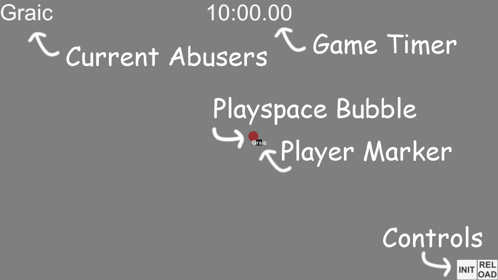

# Echo VR Playspace Abuse Detector
Tired of not knowing whether or not something was playspace abusing? Try Echo-Vr-Playspace-Abuse-Detector, the easiest way to accuse ~~jay~~ anyone of stremming.

## Installation
1. Download the latest Build.zip from the [release page](https://github.com/Graicc/Echo-Vr-Playspace-Abuse-Detector/releases/latest)
2. Extract the zip and run `EchoVrPlayspaceAbuseDetector.exe`

## Usage
Make sure you have Echo VR open and are in a game before starting the program. Click the init button to start the tracking.

Settings can be found in `EchoVrPlayspaceAbuseDetector_Data/settings.json`. All settings are in meters or meters per second. Diameter is the width of the capsule, height is the height of the capsule (isn't visible on camera but it's still used for detecting), and speed is how quickly the capsule moves to the player.

The default settings are:
* Diameter: 1.724208950996399 (circle circumscribing a 4ft x 4ft playspace, small error due to floating point values)
* Height: 2.0 (a meter up and down)
* Speed: 0.05000000074505806 (5cm/s including floating point error)

## Interface

Space can also be used for init, and 1 can be used for reloading. Reload and init are basically the same, but reload just snaps playspaces back instead of redoing the entire setup process.

## Methodology
Every player has a playspace bubble around them that follows them around using the velocity from the API. Additionally, the bubble moves towards the player's head position at 5 cm/s (adjustable in the settings file).

A stun would probably be the best punishment, although fading the screen to black like in the Lone Echo II trailer could also work. It would also need some sort of warning before stunning the player.

## Contributing
Developed using Unity 2019.2.17f1 (should work in other versions but I'm too lazy to update). Git clone the repo and add to Unity.
